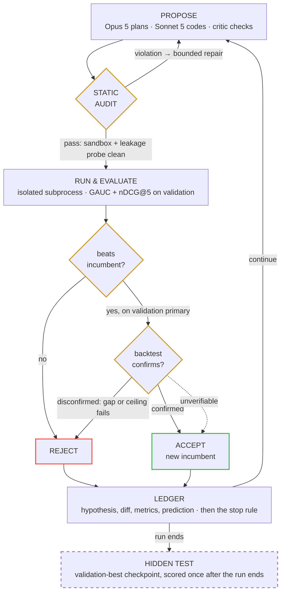

# KAIROS — an autonomous ML research agent that knows when its validation set is lying

**TikTok TechJam 2026 — Track 2: Autonomous ML Research Agent for Recommender Systems**
Benchmark: KuaiRand-Pure, within-user ranking on `long_view`, primary = mean(GAUC, nDCG@5).

| | valid | hidden test | vs baseline | produced by |
|---|---|---|---|---|
| Official FM baseline (reproduced exactly) | 0.6016 | 0.5946 | — | organizers |
| Greedy validation-following agent (control) | 0.7339 | 0.5790 | −0.0156 | control arm |
| Hand-built ensemble (reference ceiling) | 0.6045 | 0.5976 | +0.0030 | human |
| **KAIROS accepted candidate — the submission** | **0.6030** | **0.5983** | **+0.0037** | **agent** |

GAUC 0.6653 (+0.0043) · nDCG@5 0.5313 (+0.0031) · `score_dataset` **+0.0037**

**10 iterations · 2 accepts · 0 manual interventions within the run · 941 s ·
164,789 tokens (≈$1.37) · 0 GPU-hours.** Both accepted candidates were independently
backtest-confirmed. Full trajectory in
[`reports/ITERATION_LOG.md`](reports/ITERATION_LOG.md), numbers in
[`reports/RESULTS.md`](reports/RESULTS.md).

A greedy agent that trusts its validation score reaches **0.7339 on validation** here — and
**0.5790 on the hidden test set**, below the baseline it set out to beat. KAIROS is built
around that finding: it audits every result before believing it. The details are
[below](#the-finding-this-is-built-on); the caveats on the numbers above are
[here](#notes-on-the-numbers).

**Contents** — [The finding this is built on](#the-finding-this-is-built-on) ·
[How the agent works](#how-the-agent-works) ·
[The run, iteration by iteration](#the-submitted-run-iteration-by-iteration) ·
[When things go wrong](#when-things-go-wrong) ·
[What it cost](#what-it-cost) ·
[Setup](#setup) · [Reproducing](#reproducing) ·
[Rules compliance](#rules-compliance) ·
[Notes on the numbers](#notes-on-the-numbers) ·
[Limitations](#limitations-honestly) ·
[Deliverables index](#deliverables)

Everything is in this file — the tables below are the evidence, not pointers to it. The
documents in [`reports/`](reports/) are backing detail for anyone who wants to dig.

---

## The finding this is built on


*Self-contained: the tables below are the evidence, not pointers to it.
Full workings in [`reports/FINDINGS.md`](reports/FINDINGS.md).*

### A greedy agent scores below the baseline while looking like it won

We ran a control arm: an agent that does the obvious thing and follows its validation
score. Over a pool varying features **and** training objective, on the official fold:

| pipeline | valid | hidden test |
|---|---|---|
| causal features + LambdaRank | **0.7330** ← best on validation | **0.5790** ← worst on test |
| causal features + binary | 0.7170 | 0.5916 |
| frozen features + binary | 0.5987 | 0.5910 |
| frozen features + LambdaRank | 0.5973 | **0.5921** ← best on test |

Greedy argmax-on-validation takes 0.5790 where 0.5921 was available: **regret 0.0131**, and
a submission **0.0156 below the official baseline it set out to beat** — while showing a
validation score of 0.73 that looks like the task was solved.

**The damage is worse than lost points: it inverts the ranking of design choices.** With
leaky features, LambdaRank looks like the best objective in the pool and is actually the
worst. With honest features, LambdaRank genuinely *is* the best. So the greedy agent doesn't
just pick a bad candidate — it learns the *opposite* lesson about its own objective and
carries it into every later iteration.

### Why it happens

The cause is structural, not a coding slip. Evaluation ranks each user's impression list
**as a set**. A time-ordered history feature lets a validation row see the labels of its own
list-mates — which is exactly the quantity the metric asks the model to predict, and which
does not exist for test rows, whose labels stop at the horizon. So the feature is a genuine
predictor on validation and dead weight on test.

A pipeline built the natural way — each user's and item's history summarised as a
`long_view` rate, computed with a correct time-ordered prefix so no row sees its *own*
label — reaches **validation 0.7158** against a 0.8484 validation oracle, while its
**hidden-test score falls to 0.5749**. In this regime validation gain and test gain are
*anti-correlated*.

The fix is to freeze every aggregate at the **start of its evaluation window** rather than
at each row's own timestamp. That collapses the validation→test gap from **+0.1409 to
+0.0070**, and it is why every feature primitive in this repo takes an explicit horizon.

### Which signal should the agent trust?

| selection signal | rank correlation with hidden test |
|---|---|
| official validation | **−0.612** |
| backtest-fold transfer | **+0.685** |

Validation is not merely a noisy signal here — it is **negatively** correlated with the
thing being scored, so optimising it harder makes the submission worse. (A narrower pool
varying only features gives +0.297; the sign flips once the pool includes the objective
axis, which is where the leak turns destructive.)

That is why KAIROS selects on **transfer across three temporal backtest folds**, not on
argmax over one validation set.

### The auditor, and the blind spot a live run found

The auditor's strongest check is structural rather than heuristic. Within-user ranking is
invariant to any quantity constant across a user's list, so a *user-level* statistic must
have exactly **zero** within-user variance. Non-zero variance is a **proof** of label
feedback — not a heuristic flag. Under the naive construction that quantity is
**1.24e-01**; under the frozen-window fix it is **0.000e+00**.

That check has a real blind spot, and a live run found it. A candidate is free to hand-roll
a leak over a user×item *cross* under any column name — and a cross is *supposed* to vary
within a user's list, so no name- or shape-based check can see it. One got accepted at
**+0.0936 on validation** before we caught it.

The fix does not try to understand the candidate's code at all: the candidate is re-run
against a backtest fold with a genuinely unsealed test split, and checked on two independent
signals — the valid/test gap, and the absolute score against the best honest result ever
measured there. One catches a gap-widening leak, the other catches a globally-inflating leak
that keeps the gap small. Verified in both directions against the exact candidate that
slipped through and against a known-honest one.

### Why the honest ceiling is ~0.60, not 0.86

Nested model fits on validation, each rung adding one information source:

| signal | standalone | cumulative | marginal |
|---|---|---|---|
| context (tab) | 0.5399 | 0.5405 | — |
| + item quality | 0.5807 | **0.5955** | **+0.0550** |
| + item × context | 0.5877 | 0.5966 | +0.0011 |
| + duration fit (user × durbucket) | 0.4914 | 0.5935 | −0.0030 |
| + affinity (user × author) | 0.4825 | 0.5938 | +0.0002 |
| + affinity (user × item) | 0.4818 | 0.5940 | +0.0002 |

**Context plus item quality alone reaches 0.5955 — already above the official baseline's
0.5946.** Every personalisation feature after that is worth approximately nothing: the FM's
ID embeddings buy about **+0.006** over a model with no personalisation at all. On
KuaiRand-Pure the "recommender" part of the recommender system is worth ~0.006 of primary;
the task is ~95% context and item quality.

This is the context for reading **+0.0037**. It is not a small share of the 0.8645 oracle;
it is a meaningful share of the ~0.006 that personalisation actually has to give, and it
explains why the organizers' own feature and capacity ablations went flat.

### What did not work — roughly 30 null results

Recorded because negative results at this noise floor are the substance of the work
(per-seed σ = 0.0008 against a decision threshold of 0.002, so anything single-seed is
unsafe):

- **Objective alignment** — all six losses within seed noise; LambdaRank/soft-nDCG *worst*
  on validation (0.5936 vs BCE 0.6010)
- **Watch-time regression targets** (L2 / Huber / D2Q) — far below the binary target
- **Recency weighting** of training rows — a single-seed phantom, retracted on re-run
- **Eight item-quality estimators** (time-decay × hierarchical shrinkage) — best +0.0002
- **Four tab encodings** — all within noise
- **Seed averaging beyond 3** — saturates (1/3/5/10 seeds → 0.6013/0.6026/0.6027/0.6027)
- **DIN history reweighting** — all modes within noise, and a *perfect* train/serve
  distribution match was the worst option
- **Power/gamma rank fusion** — raised validation 0.6031→0.6035, lowered test
  0.5985→0.5982: our own central finding, reproduced on our own work
- **Monotone post-processing** — provably a no-op: GAUC and nDCG depend only on within-user
  order, which a monotone map cannot change

### Bonus benchmark: KuaiRand-1k

The same agent, same code, `KAIROS_VARIANT=1k` — 11.7M rows, 4.37M items, and **117× more
history per user** (5,143 rows/user vs Pure's 44).

| | Pure | 1k |
|---|---|---|
| FM baseline (valid / test) | 0.6016 / 0.5946 | 0.5778 / 0.5856 |
| agent best (validation) | 0.6030 | **0.6522 (+0.0744)** |
| backtest-confirmed | yes | yes — gap −0.0026 vs 0.035 threshold |

The 20× larger gain supports the structural prediction: personalisation is worth ~0.006 on
Pure because 44 rows per user is too few to estimate a user's preferences, and 1k removes
exactly that constraint. **Caveat:** the leak detector's absolute-ceiling threshold is
calibrated on Pure and cleared by only 0.0060 here, so the *gap* check is what carries that
verdict. Details in [`reports/RESULTS_1K.md`](reports/RESULTS_1K.md).

Porting to 1k also found **five latent defects in our own code** — positional side-table
indexing, an inert `RLIMIT_AS` guard, cross-variant cache collisions, an unguarded
evaluation subprocess, and a prewarm deadlock — every one invisible on Pure and silently
wrong rather than loud. A second dataset is an assumption detector, independent of score.

---

## How the agent works


Two gates stand between a candidate and acceptance. A validation improvement alone is
never enough, and the hidden test split sits outside the loop entirely:



The dotted edge is the one place the second gate yields: if the backtest cannot run at
all, an *ordinary* gain is accepted and flagged `unconfirmed_accept` in the ledger,
while an implausible one is still blocked. An infrastructure failure and a
disconfirmation are different evidence and are not recorded as the same thing.

In detail — a single loop, roughly 300 lines in
[`kairos/agent/loop.py`](kairos/agent/loop.py):

1. **Propose** — a two-stage LLM step. Opus 5 plans a hypothesis, its *mechanism*, and one
   falsifiable prediction (a named diagnostic and a direction). Sonnet 5 writes the code. A
   critic pass audits whether the prediction actually follows from the mechanism.
2. **Audit statically** — an allowlisted sandbox; outcome columns are blocked at
   `ctx.col()`; a leakage probe requires that any user-level statistic derived from a new
   primitive has exactly zero within-user variance.
3. **Run in isolation** — a subprocess bounded in both time and memory, with an RSS
   watchdog so an over-allocating candidate cannot take the parent down.
4. **Evaluate** — vectorised GAUC/nDCG@5, verified identical to the organizers'
   `evaluate.py` to 4.4e-16 across seven stress cases including heavy ties, and 13× faster.
5. **Confirm** — every accepted candidate is re-run against a backtest fold, checked on two
   independent leak signals (valid−test gap, absolute ceiling).
6. **Score the prediction** — did the diagnostic move as promised? Recorded as HIT, miss, or
   *unverifiable* — never silently as a miss.
7. **Decide** — accept only on validation improvement plus confirmation; log the outcome,
   the code diff, and any error and recovery.

The agent's action space is the `ctx` API in
[`kairos/agent/context.py`](kairos/agent/context.py): frozen-window label aggregates with an
explicit horizon, out-of-sample model scores (FM, DIN, implicit-ALS MF, item-item CF,
disjoint sub-space experts), item and user attributes, and a `mode='scores'` path that lets
a candidate train its own models and fuse their outputs at rank level.

---

## The submitted run, iteration by iteration


Every iteration, verbatim from the ledger. Generated by `experiments/export_run_log.py`;
full hypotheses, mechanisms and code diffs in
[`reports/ITERATION_LOG.md`](reports/ITERATION_LOG.md).

| # | decision | valid | Δ vs incumbent | prediction | family | hypothesis |
|---|---|---|---|---|---|---|
| 1 | accept | 0.6028 | +0.0012 | HIT | ensemble | Beat the incumbent 0.6034 rank-fusion blend with a better-composed, variance-r… |
| 2 | reject | 0.5997 | -0.0031 | miss | ensemble | Broaden the fusion from the current 2-member blend to a 5-member plain-linear … |
| 3 | reject | 0.5975 | -0.0054 | miss | history | Add personalised item-attribute affinity features (user x video-duration-bucke… |
| 4 | reject | 0.6014 | -0.0014 | miss | ensemble | Feed LightGBM a fusion matrix built from FIVE decorrelated member signals (ctx… |
| 5 | reject | 0.5998 | -0.0030 | miss | ensemble | Consolidation move: extend the incumbent fusion from the two strongly-correlat… |
| 6 | reject | 0.6007 | -0.0021 | miss | ensemble | Consolidation move: build the incumbent matrix but add an explicitly precomput… |
| 7 | reject | 0.6023 | -0.0006 | miss | ensemble | CONSOLIDATION (0 misses left, so this is deliberately the low-variance move, n… |
| 8 | accept | 0.6030 | +0.0001 | miss | ensemble | CONSOLIDATION move (0 misses left, so minimal-risk): keep the incumbent linear… |
| 9 | reject | 0.6020 | -0.0009 | miss | ensemble | CONSOLIDATION move (0 misses left): keep the incumbent rank-fusion exactly as-… |
| 10 | reject | 0.5982 | -0.0047 | miss | ensemble | Consolidation move (not exploratory): keep the incumbent fusion exactly as-is … |

Two accepts (iterations 1 and 8), both independently backtest-confirmed:

| accept | backtest_a valid | backtest_a test | gap (threshold 0.035) | verdict |
|---|---|---|---|---|
| iteration 1 | 0.5968 | 0.5970 | −0.0001 | CONFIRMED |
| iteration 8 | 0.5967 | 0.5979 | −0.0012 | CONFIRMED |

**The winning move, chosen unprompted at iteration 1:** abandon the
single-downstream-tree architecture and blend several decorrelated model outputs at the
*rank* level — dropping the user-level expert on the argument that a score built only from
user features is constant across a user's list and therefore **provably cannot change GAUC
or nDCG**. That is the same design a human reached only after several failed attempts, and
the reasoning is the agent's own: it is in the hypothesis text of iteration 1 in
[`reports/ITERATION_LOG.md`](reports/ITERATION_LOG.md).

**Prediction hit-rate: 1 of 10.** An earlier 3-iteration run scored 2 of 3 and we suggested
an adversarial critic had improved the agent's reasoning. Ten iterations is a more honest
sample and the claim is withdrawn — the agent beats the baseline while the diagnostics it
predicts will move largely do not move. Reported because scoring predictions is only
worthwhile if the unflattering answer is reported too.

---

## When things go wrong


A research loop is judged by what it does with failure, not by avoiding it. Every mechanism
here exists because the failure actually happened during this project and is recorded in
the logs.

| failure | what the agent does | pinned by |
|---|---|---|
| candidate raises an exception | traceback goes back to the coder; up to 2 repair attempts, planner not re-invoked | `ledger_errors.jsonl` |
| candidate hangs | per-candidate wall-clock budget; process killed and reported as a normal failure | `verify_mem_guard.py` |
| candidate exhausts memory | parent-side RSS watchdog kills the child, so the run survives | `verify_mem_guard.py` |
| candidate leaks a label | structural audit, then independent backtest confirmation on every accept | `verify_agent_mechanisms.py` |
| a check cannot be run at all | reported as *unverifiable*, never as *disproved* | `verify_agent_mechanisms.py` |
| a cached signal is the wrong shape | refused at load, with both row counts named | `verify_variant_isolation.py` |

**What the agent recovered from in this project, unaided:**

- Two structural API mistakes, self-corrected from the error text alone
- An invalid LightGBM hyperparameter name (`n_estimators`, an sklearn/XGBoost name),
  repaired rather than crashing the iteration
- Its own leaking candidate — accepted at +0.0936 validation — caught by the auditor before
  it could be believed
- Six scheduler interventions in the submitted run: with one miss left the loop enters
  `consolidate` mode and re-asks the planner for ~2k tokens, rather than spending a full
  training run and the last of the budget on a hypothesis family that has already lost
  repeatedly. That mechanism is what produced the accepted iteration 8.

**Zero iterations in the submitted run crashed.**

Ten test suites run green — `experiments/verify_*.py` is the complete list, and each one
was written the day the corresponding thing broke.

---

## What it cost


| | |
|---|---|
| Tokens (in + output) | **164,789** |
| Wall-clock | **941 s** (~16 min) |
| Iterations | **10** of the 50 cap |
| GPU-hours | **0** — CPU only, on a laptop |
| API cost | **≈$1.37** |

The whole submitted campaign is about a dollar and a quarter and finishes inside twenty
minutes without a GPU. That is the point: a loop a researcher could actually afford to run
on every idea they have.

---

## Verified reproduction of the official baseline


Seeds 0–4, matching the published protocol:

| | ours | published |
|---|---|---|
| valid primary | 0.6016 | 0.6016 |
| test primary | 0.5946 | 0.5946 |
| test std (5 seeds) | 0.0008 | 0.0008 |
| test GAUC / nDCG@5 | 0.6610 / 0.5282 | 0.6610 / 0.5282 |

Row order is also byte-identical to `data.load()` on all three splits — checked because
submission alignment is positional and `(user_id, video_id)` is not unique (3.06% of test
rows are repeated pairs).

## What it was built with

**Development tools.** Claude Code (Anthropic) as the pair-programming environment; VS Code;
Python 3.14; git. No notebooks — every result in this repo comes from a committed script.

**APIs.** Anthropic Messages API. The agent runs a two-stage proposer: `claude-opus-5` as
the planner (10 calls, 35,479 in / 22,491 out) and `claude-sonnet-5` as the coder (26 calls,
80,755 in / 26,064 out). The proposer is provider-agnostic — it also drives any
OpenAI-compatible `/chat/completions` endpoint (Volcengine Ark / Doubao, OpenRouter,
DeepSeek, or a local Ollama server), selected by one command-line string, and a scripted
no-LLM `pool` proposer exists for offline testing.

**Libraries.** NumPy, SciPy, pandas (loading only), LightGBM, PyTorch, httpx, and the
`anthropic` SDK. The evaluation kernel is pure NumPy.

One practical note: `torch` and `lightgbm` each bundle their own OpenMP runtime and abort —
or, as we found the hard way, silently **deadlock** — if loaded into the same process.
Everything here keeps them in separate processes. The commonly-cited
`KMP_DUPLICATE_LIB_OK` workaround is deliberately **not** used, because it can silently
produce wrong numbers.

**Datasets.** KuaiRand-Pure for the required benchmark (Zenodo record 10439422), plus
KuaiRand-1k for the bonus attempt, each trained on its own splits. No external training
data and no pretrained weights, per the track's single hard rule. The randomized-exposure
log (`log_random_4_22_to_5_08_pure.csv`) is deliberately **not** used for training: it spans
the test window, so training on it would inject label information from that period.

**Scoring discipline.** The official `evaluate.py` is committed unmodified and is the sole
scoring authority; our vectorised evaluator is verified identical to it to 4.4e-16. Every
consultation of the sealed test split goes through an audited scorer, and that log
(`runs/scorer_audit.log`, 60 entries) is published with the submission.

---

## Setup


```bash
# dataset (194 MB, no registration)
curl -LO https://zenodo.org/records/10439422/files/KuaiRand-Pure.tar.gz
tar xzf KuaiRand-Pure.tar.gz

python3 -m venv .venv
./.venv/bin/pip install numpy scipy pandas pyarrow lightgbm torch anthropic
# macOS only: lightgbm needs libomp
brew install libomp
```

Note: `torch` and `lightgbm` each bundle their own OpenMP runtime and abort if imported
into the same process. Everything here keeps them in separate processes. The documented
`KMP_DUPLICATE_LIB_OK` workaround is deliberately **not** used — it can silently produce
wrong numbers, which is not acceptable on a benchmark.

## Reproducing


```bash
# the headline number, straight from the shipped submission file - no API key, ~30 s
./.venv/bin/python experiments/verify_submission.py    # official evaluate.py on submission.csv

# contract tests - these are the guarantees everything else rests on
./.venv/bin/python experiments/verify_metrics.py       # fast metrics == official evaluate.py
./.venv/bin/python experiments/verify_causal.py        # prefix aggregates vs brute force
./.venv/bin/python experiments/verify_frozen.py        # frozen aggregates vs brute force
./.venv/bin/python experiments/audit_assumptions.py    # silent-failure assumptions
./.venv/bin/python experiments/verify_baseline.py      # 5-seed reproduction of the baseline

# findings
./.venv/bin/python experiments/exp02_loss_ablation.py  # objective alignment: no effect
./.venv/bin/python experiments/exp03_diagnose.py       # where the metric is actually lost
./.venv/bin/python experiments/exp06_frozen.py         # the leak, and the fix
./.venv/bin/python experiments/exp11_selection.py      # selection-rule comparison

# the agent
./.venv/bin/python experiments/exp08_agent_smoke.py    # end-to-end, incl. catch-and-recover

# regenerate deliverables 3 and 4 from the run artifacts
./.venv/bin/python experiments/export_run_log.py       # -> reports/ITERATION_LOG*.md
./.venv/bin/python experiments/results_table.py        # -> reports/RESULTS.md
```

To re-run the submitted campaign end to end (needs an API key, ~16 min, ≈$1.37):

```bash
export ANTHROPIC_API_KEY=sk-ant-...
./run_submission.sh    # writes to runs/kairos_submission_rerun/; refuses to clobber the archive
```

`run_submission.sh` is the reproduction entry point: paths are relative to the repo root and
the key comes from the environment. `run_live.sh` and `run_agent.sh` are development
scripts kept for provenance — `run_live.sh` in particular reflects an earlier configuration
and is not the submitted run.

## Rules compliance


Judging is by code review of the pipeline and run logs, so each rule is listed with the
code that enforces it and the test that pins it.

| rule | how this repo satisfies it | pinned by |
|---|---|---|
| Never train on the test split or use its labels — including for model selection, early stopping, threshold tuning, or feature statistics | `also_test` is **hard-refused** on the official fold (`evaluate_candidate.py` raises); training, early stopping and candidate acceptance all read validation only; test-row features use horizon 20220428, so no test label enters any feature | `verify_train_split_only.py` |
| Training data is the train split only (FAQ 2.9.2) | every trainer is clamped to `date <= 20220421`; the one ambiguous case is an explicit flag defaulting to strict — see [`reports/DATA_DISCIPLINE.md`](reports/DATA_DISCIPLINE.md) | `verify_train_split_only.py` |
| `log_random` may not be training data (FAQ 2.9.2.1) | never loaded by any training path | — |
| KuaiRand-1k/27k may not be auxiliary training data for Pure (FAQ 2.9.2.2) | enforced structurally: every signal cache is keyed by variant and a cached array of the wrong length is **refused**, so a 1k signal cannot enter a Pure run even by mistake | `verify_variant_isolation.py` |
| No external training data or pretrained weights | nothing outside KuaiRand is read; no pretrained weights | — |
| Convergence: a team may declare its own ε, N and floor if fixed before the run and recorded (FAQ 2.9.1) | declared ε = 0.002, **N = 5**, floor 10, recorded in `run_submission.sh` before the run; implemented in `Ledger.stall_counter`, and crashed iterations are skipped rather than counted as misses | `verify_stall_counter.py` |
| The scored submission is the validation-best checkpoint at the point the run stops (FAQ 2.9.1c) | satisfied — though the run stopped on the self-imposed 150k token budget, not on the ε/N rule; the stop reason is quoted verbatim from `runs/live_submission.log` in `reports/RESULTS.md` | run log |
| Caps: 50 iterations, 6 h wall-clock | `max_iters` and `max_seconds` in `Kairos`; the submitted run used 10 iterations and 941 s, so neither cap was approached | `verify_stall_counter.py` |
| Submission is the validation-best checkpoint, scored once | selection reads `valid_primary` only; every consultation of the test split is appended to `runs/scorer_audit.log` with its reason | audit log |

**On the §2.3 metric line.** §2.3 lists "NDCG@10 / Recall@50, click = positive". This
contradicts §2.4, §2.6 and Appendix A.4, which all specify **GAUC / nDCG@5 on `long_view`**,
and A.4 notes Recall@50 is 0.999+ for every model including random scoring. §2.4 states the
task is "pinned in the Starter Kit", and the shipped `evaluate.py` computes GAUC / nDCG@5.
We follow the Starter Kit.

## Notes on the numbers

**How the run ended.** A convergence rule was declared before the run and recorded in
[`run_submission.sh`](run_submission.sh), as FAQ 2.9.1 permits: ε = 0.002, **N = 5**,
minimum-iteration floor **10**. Both stopping conditions became true at the same moment:
after iteration 10 the stall counter stood at 10 (>= N=5) with the floor satisfied, **and**
the self-imposed 150k token budget was spent. The loop checks the budget first, so the log
records `STOPPED: token budget exhausted (164,789 >= 150,000)` — verbatim in
[`runs/live_submission.log`](runs/live_submission.log). The run summary reports both
separately (`stop_kind: token_budget`, `converged_predicate: true`) rather than collapsing
them, because "converged" alone would misdescribe how the loop exited. The scored
submission is the validation-best checkpoint at the point the run stopped, which is what
FAQ 2.9.1(c) requires; the hard caps (50 iterations, 6 h) were never approached.

### What "0 interventions" does and does not mean

No human touched the run once it
started: no code was edited, no candidate was hand-fixed, no result was overridden. But the
run is *seeded* with [`PRIOR_PURE`](kairos/agent/prior.py) — a human-written lab notebook
carrying the incumbent's validation score, a "WHAT WON" section naming the winning
architecture, and a ruled-out list distilled from roughly thirty earlier experiments. The
candidate accepted at iteration 1 implements the architecture that prior describes. So the
honest statement is **zero interventions within the run, plus one human-authored prior**,
and the prior is a substantial input. It carries a contamination rule (nothing in it may
cite or derive from the test split) and its provenance is in the module docstring. Reported
this way because a judge who finds `prior.py` after reading a bare "0 manual interventions"
should find it unsurprising rather than misleading.

**The submission is the agent's output by construction.** The hand-built ensemble in the
table above is a *reference ceiling* we measured to know what the agent was competing
against — it was never a candidate for the submission slot. That matters because it has
HIGHER validation (0.6045) and LOWER test (0.5976) than the agent's candidate: if the
submission had been chosen on validation across both, the hand-built one would have won and
scored worse. It was excluded because it is not agent-produced, not because of its scores.
It is committed as [`reference_handbuilt_ensemble.csv`](reference_handbuilt_ensemble.csv) —
named so it cannot be mistaken for a submission — and scores 0.5976 under
`experiments/verify_submission.py reference_handbuilt_ensemble.csv`.

**Seed determinism.** The accepted candidate reports `valid_std: 0.0` from a single seed.
That is not a violation of the >=3-seed rule used elsewhere in this repo: under
`mode='scores'` the candidate performs rank fusion of already-computed signals, which
involves no stochastic training, so repeated seeds are bit-identical by construction.
Claims about *trained* models in this repo use >=3 seeds.

Reproduce the submitted run: `export ANTHROPIC_API_KEY=... && ./run_submission.sh` ·
re-score the shipped submission in ~30 s with no API key:
`./.venv/bin/python experiments/verify_submission.py` ·
full writeups in [`reports/`](reports/)

---

## Limitations, honestly


- **Absolute gains are modest, and the headroom is genuinely small.** The scored
  improvement comes mostly from ensembling and disciplined selection, not from a stronger
  model. Our own decomposition is the reason to expect that: context plus item quality
  alone reaches 0.5955 — already above the official baseline — and every personalisation
  feature combined adds roughly 0.006 on top. The honest ceiling on this benchmark is near
  0.601, not the 0.8645 oracle, so +0.0037 is a meaningful share of what is actually
  available rather than a small share of what is theoretically available.
- **Several well-motivated directions produced nothing measurable:** objective alignment
  (all six losses within seed noise), recency weighting, and watch-time regression as a
  ranking target.
- **The noise floor is close to the decision threshold.** Per-seed std is 0.0008 while the
  competition's convergence rule needs +0.002, so single-seed conclusions are unsafe here.
  Every claim above uses ≥3 seeds; two of our own early conclusions were retracted when
  re-run with seeds.
- **Backtest folds are imperfect analogues.** They live inside the public-label region, so
  their test windows are 6–7 days against the official 10, and their training windows are
  shorter.
- **The 27k bonus benchmark is not attempted.** KuaiRand-1k is ported and measured (see
  below); 27k is 322M interactions and was out of reach on a 16GB laptop.
- **The 1k transfer probe has not finished.** The port is done, the FM baseline is
  reproduced (valid 0.5778 / test 0.5856), and the porting process found five latent defects
  in our own code. A campaign is **in flight at the time of writing**: iteration 2 accepted a
  candidate at validation 0.6522 (+0.0744 over 1k's own baseline, single seed,
  backtest-confirmed). No 1k hidden-test score has been taken and no 1k submission file
  exists. A gain that large is, on this project's own argument, a reason for suspicion until
  confirmed rather than a result to advertise. Current state in
  [`reports/RESULTS_1K.md`](reports/RESULTS_1K.md). An earlier 1k attempt did stall — every
  large-gain candidate was rejected because backtest confirmation blew its timeout — and the
  cause turned out to be narrower than "the verifier is too expensive": prewarm did not cover
  the confirmation fold, so each check rebuilt two windowed FMs over 11.7M rows inside the
  sandbox.
- **The leak detector's absolute-ceiling threshold is calibrated on Pure.**
  `HONEST_CEILING` in `_backtest_confirm` comes from measurements on KuaiRand-Pure's
  backtest folds. On another variant it has no calibration behind it, so the detector's
  gap check transfers but its ceiling check does not.
- **The prediction hit-rate did not hold up.** An earlier 3-iteration run scored 2 of 3
  and we suggested the adversarial critic had lifted it from 0 of 2. The submitted
  10-iteration campaign scored **1 of 10**. Ten is a more honest sample than three, so the
  earlier reading was noise and the claim is withdrawn: the agent beats the baseline while
  the diagnostics it predicts will move largely do not move. Predictions remain worth
  scoring — an agent that commits to a falsifiable claim can be checked, and this is what
  being checked looks like when the answer is unflattering.

## What is in here


| path | what it is |
|---|---|
| `kairos/kernel/fastmetrics.py` | vectorised GAUC / nDCG@5, exact to 4.4e-16 vs the official `evaluate.py`, 12x faster |
| `kairos/kernel/dataset.py` | cached columnar loader; test labels sealed behind an audited `Scorer` |
| `kairos/kernel/causal.py` | streaming prefix aggregates **and** window-frozen aggregates |
| `kairos/kernel/frozenfeat.py` | deployment-faithful feature matrix + per-fold window schedules |
| `kairos/kernel/diagnostics.py` | per-slice headroom attribution and pairwise inversion attribution |
| `kairos/kernel/candidates.py` | pipeline pool spanning the leaky↔honest axis |
| `kairos/agent/auditor.py` | temporal-validity checks; BLOCK vetoes a candidate |
| `kairos/agent/sandbox.py` | AST allowlist + subprocess isolation for LLM-authored code |
| `kairos/agent/selection.py` | transfer / stability / shrinkage corrections to argmax |
| `kairos/agent/ledger.py` | per-iteration run log; also the stall-budget accounting |
| `kairos/agent/loop.py` | the controller |
| `experiments/` | every experiment and every contract test |

The official starter kit (`evaluate.py`, `data.py`, `baseline.py`, `submit.py`,
`ablation_features.py`, `baseline_scores.json`) is committed **byte-for-byte unmodified**;
`evaluate.py` is the sole authority on scoring. The organizers' original README is
preserved verbatim as `STARTER_KIT_README.md` (renamed only so GitHub displays this file).

## Deliverables


Where each item the track asks for lives in this repo.

| # | Deliverable | Where |
|---|---|---|
| 1 | Written project description (Devpost) | [`reports/DEVPOST.md`](reports/DEVPOST.md) — includes tools, APIs, libraries and datasets used |
| 2 | Public repository with a README | this file; setup, reproduction steps, limitations and contributions below |
| 3 | Per-iteration run log — hypothesis, code diff, metrics, error/recovery events | [`reports/ITERATION_LOG.md`](reports/ITERATION_LOG.md) (Pure) · [`reports/ITERATION_LOG_1K.md`](reports/ITERATION_LOG_1K.md) (1k bonus) · raw ledgers in [`runs/kairos_submission_repro/`](runs/kairos_submission_repro/) |
| 3 | Manual-intervention summary | **0 within the run**, plus one human-authored prior — stated in full [above](#what-0-interventions-does-and-does-not-mean) and in [`reports/RESULTS.md`](reports/RESULTS.md) |
| 4 | Final model output in the starter-kit schema | [`submission.csv`](submission.csv) — 170,588 rows, passes `python3 submit.py --check` |
| 4 | Results table + absolute delta over the baseline | [`reports/RESULTS.md`](reports/RESULTS.md), generated by `experiments/results_table.py` |
| 4 | Resource usage — tokens, wall-clock, iterations, GPU-hours | [`reports/RESULTS.md`](reports/RESULTS.md) — 164,789 tokens, 941 s, 10/50 iterations, 0 GPU-hours |
| — | Bonus benchmark (KuaiRand-1k) | [`reports/RESULTS_1K.md`](reports/RESULTS_1K.md) |

Everything in Deliverables 3 and 4 is **generated from run artifacts**, not typed by hand:
`experiments/export_run_log.py` renders the ledgers, `experiments/results_table.py` renders
the results table, and `experiments/verify_submission.py` re-scores `submission.csv` with the
organizers' own `evaluate.py` and exits non-zero if any reported metric has drifted.

### The rest of `reports/`

| file | what it is |
|---|---|
| [`FINDINGS.md`](reports/FINDINGS.md) | the full technical record — every experiment, including the ~30 that produced nothing |
| [`DATA_DISCIPLINE.md`](reports/DATA_DISCIPLINE.md) | exactly which rows each model is fitted on, and the one ambiguous case |
| [`BUILD_REVIEW.md`](reports/BUILD_REVIEW.md) | a self-review of the build, written mid-project |
| [`UPDATE.md`](reports/UPDATE.md) | what changed after that review |
| [`RESEARCH_PROPOSALS.md`](reports/RESEARCH_PROPOSALS.md) | twelve proposed research directions, scored against measurement — 1 of 12 paid off |

The last three are **historical**: they describe the earlier 3-iteration campaign and carry
a banner saying so. They are kept because the negative results and the retracted claims in
them are part of the evidence, not despite it.

---

## Contributions


Solo entry. All code in `kairos/` and `experiments/` written for this submission; the
files listed as the official starter kit are the organizers' and are unmodified.
